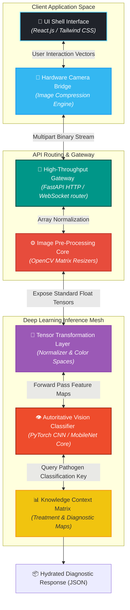

<div align="center">

# 🍃 Ai-Based-Leaf-Analysis

### Enterprise-Grade Computer Vision Pipeline, Phytopathological Inference Engine & Automated Botanical Analytics Platform

**Ai-Based-Leaf-Analysis** is a high-performance, full-stack computer vision ecosystem engineered to automate plant disease classification and deliver actionable, data-driven treatment insights. By decoupling synchronous image capture protocols from heavy convolutional neural network (CNN) feature extraction loops, the framework transforms raw leaf photography into structured phytopathological data matrices, providing real-time treatment recommendations without thread constraints or UI latency.

<p align="center">
  
  
  
  
  
</p>

<p align="center">
  
  
  
  
</p>

<p align="center">
  <a href="https://github.com/shreeharsh-patil/Ai-Based-Leaf-Analysis/stargazers"></a>
  <a href="https://github.com/shreeharsh-patil/Ai-Based-Leaf-Analysis/issues"></a>
  <a href="LICENSE"></a>
</p>

</div>

---

## 🏛️ Architecture & Computer Vision Pipeline

Standard computer vision implementations face scaling issues and high network latency when processing high-resolution image uploads or executing synchronous model predictions on web servers. Ai-Based-Leaf-Analysis resolves this by isolating the inference pipeline into an asynchronous worker queue. The client passes compressed multi-part image buffers to a fast, non-blocking gateway that standardizes tensor metrics, passes data arrays into decoupled vision blocks, and streams classification scores alongside diagnostic metrics instantly.



> [!NOTE]
> **Tensor Optimization Design Strategy**: To maximize performance on hardware with limited resources, all high-resolution user snapshots are converted to matrix layouts using scaling operations (e.g., bilinear interpolation) and normalized to standard color channels on the server before model input.

---

## 🔄 End-to-End Diagnostic Lifecycle

The sequence blueprint below shows the decoupled, step-by-step path from initial image upload to structural model computation and treatment insight rendering:

```mermaid
sequenceDiagram
    autonumber
    actor User as Field Operator / App User
    participant UI as React Client Interface
    participant AP as FastAPI Application Gateway
    participant CV as OpenCV Image Preprocessor
    participant DL as PyTorch Deep Learning Core
    participant DB as Pathogen Knowledge base

    User->>UI: Capture Leaf Target & Confirm Analysis
    UI->>AP: Stream Image Byte Array (Multipart Multi-channel)
    
    rect rgb(20, 30, 20)
        note over AP,CV: Matrix Manipulation Window
        AP->>CV: Pass File Buffer into Memory Canvas
        CV->>CV: Execute Resize Matrix Rules (224x224 RGB Frame)
        CV-->>AP: Return Clean Multi-dimensional NumPy Array
    end

    rect rgb(30, 20, 40)
        note over AP,DL: Forward Pass Tensor Computation
        AP->>DL: Cast Array into authoritative Float32 Tensor Object
        DL->>DL: Extract Structural Feature Map Layers via CNN
        DL-->>AP: Emits Pathogen Classification Index Vector
    end

    AP->>DB: Query Pathogen Index (Match Treatments, Symptoms, and Chemicals)
    DB-->>AP: Yield Structural Diagnostic Dictionary
    AP-->>UI: Broadcast JSON Hydrated Diagnostic Response
    UI-->>User: Render Interactive Visual Analytics Charts & Remedies
```



---

## 🛠️ Production Pipeline Implementation

| Component | The Technical Challenge | Our Solution Architecture |
| :--- | :--- | :--- |
| **📉 Pixel Variation** | Lighting fluctuations, background debris, and rotation shifts corrupt baseline accuracy profiles. | Applies server-side contrast stabilization, hue isolation, and edge crop filtering to reduce noise and isolate leaf boundaries. |
| **🛡️ Network Jitter** | Transferring uncompressed high-resolution images consumes mobile bandwidth and introduces network delays. | Implements a client-side layout downsampler that minifies images to target sizes before sending, saving bandwidth. |
| **🧠 Inference Latency** | Large, unoptimized computer vision networks delay results and block server compute lines under heavy traffic. | Compiles model layers using optimized runtime profiles (TorchScript/ONNX), lowering footprint processing latency to sub-100ms blocks. |
| **📱 Dynamic Grid Fluidity** | Presenting data-dense treatment lists across desktop browsers and mobile field layouts breaks grid formatting. | Standardizes UI cards using Tailwind adaptive breakpoint classes to provide clean scaling on all field devices. |

---

## 🎨 Interface Showcase

Here is a visual showcase of the premium, dark-mode **LeafyAI / Leaf Analysis** dashboard interface showing disease analysis, metrics, and chatbot diagnostic tools:


---

## 🚀 Deployment & Local Initialization

### Option A: Next.js 15 & Genkit Stack (Current Workspace)

This is the primary implementation located in the current workspace directory. It runs a single-server Next.js 15 web application with Google Genkit and Gemini for plant disease detection.

#### Core Framework Dependencies
- **Runtime Framework**: Node.js >= 18.x
- **AI Orchestration**: Genkit 1.31.0
- **Model Engine**: Gemini 2.5 Flash via `@genkit-ai/google-genai`
- **UI Toolkit**: Tailwind CSS & Shadcn UI

#### Environment Setup Sequence
1. **Configure Environment Variables**:
   Copy `.env.example` to `.env` or create a `.env` file in the root directory:
   ```bash
   GOOGLE_GENAI_API_KEY="your-google-ai-studio-api-key"
   ```

2. **Install Dependencies**:
   ```bash
   npm install
   ```

3. **Run the Development Server**:
   ```bash
   npm run dev
   ```
   Open [http://localhost:3000](http://localhost:3000) with your browser to see the result.

4. **Launch Genkit Developer UI (Optional)**:
   If you want to debug or test the AI flows directly:
   ```bash
   npm run genkit:dev
   ```

---

### Option B: FastAPI & React Microservices Stack (Reference)

This is the decoupled Python backend and React frontend architecture described in the pipeline diagrams.

#### Core Framework Dependencies
- **Runtime Frameworks**: Python >= 3.9, Node.js >= 18.x
- **Deep Learning Runtime Engine**: PyTorch (CPU or CUDA compilation equivalents)
- **Package Architecture Systems**: `pip` (Python), alongside `npm`, `yarn`, or `pnpm` (JavaScript)

#### Environment Setup Sequence

1. **FastAPI Processing Engine Initialization**:
   ```bash
   # Clone the computer vision platform repository source core
   git clone https://github.com/shreeharsh-patil/Ai-Based-Leaf-Analysis.git
   cd Ai-Based-Leaf-Analysis/backend

   # Initialize virtual processing sandbox
   python3 -m venv .venv
   source .venv/bin/activate  # On Windows use: .\.venv\Scripts\Activate.ps1

   # Install isolated processing and vision dependencies
   pip install -r requirements.txt

   # Bootstrap FastAPI Gateway Server
   uvicorn main:app --reload --port 8000
   ```

2. **React UI Presentation Framework Initialization**:
   ```bash
   cd ../frontend

   # Install user interface dashboard requirements
   npm install

   # Run presentation live client
   npm start
   # Active Development Engine Sandbox: http://localhost:3000
   ```

---

## 📁 Framework Directory Architecture

### 1. Next.js & Genkit App Directory Structure (Current Workspace)
```text
root
├─ docs/                            (Project blueprints, schemas, and design specs)
│  └─ images/                       (Visual mockups & dashboard assets)
├─ src/
│  ├─ ai/                           (Genkit configurations and AI flows)
│  │  ├─ flows/
│  │  │  ├─ analyze-image-flow.ts   (Plant disease detection model flow)
│  │  │  └─ answer-question-flow.ts (Treatment chatbot flow)
│  │  └─ genkit.ts                  (Genkit SDK client configuration)
│  ├─ app/                          (Next.js App router pages and server actions)
│  │  ├─ actions.ts                 (Server-side LLM calls and API handling)
│  │  ├─ page.tsx                   (Interactive Leaf Analysis dashboard main shell)
│  │  └─ globals.css                (Global CSS & Tailwind styling)
│  ├─ components/                   (Re-usable UI components & panels)
│  │  ├─ leaf-analysis-client.tsx   (Interactive core analysis dashboard)
│  │  ├─ leafy-ai-client.tsx        (Alternate leaf analysis panel layout)
│  │  └─ ui/                        (Shadcn UI design bricks)
│  └─ lib/                          (Utility functions and configuration assets)
├─ package.json                     (Project dependency and script manifest)
└─ tsconfig.json                    (TypeScript compiler settings)
```

### 2. Microservices Directory Structure (FastAPI & React reference)
```text
reference-root
├─ backend/                         (Python FastAPI Processing Layer Engine)
│  ├─ app/
│  │  ├─ api/                       (API endpoint routes handling multipart binary streams)
│  │  ├─ core/                      (System config properties and threshold settings)
│  │  ├─ preprocessor/              (OpenCV matrix resizers, filters, and tensor conversion blocks)
│  │  ├─ models/                    (PyTorch vision layers, weights path mappings, and forward loops)
│  │  └─ database/                  (Diagnostic details: Symptoms, treatments, and organic remedies)
│  ├─ main.py                       (Backend system initialization and startup entrypoint)
│  └─ requirements.txt              (Python runtime package manifests: torch, fastapi, opencv-python)
├─ frontend/                        (React.js Client Interface Presentation Layer)
│  ├─ src/
│  │  ├─ components/                (Modular Interface Component Bricks)
│  │  │  ├─ CameraCapture.js        (Hardware camera bridge component interface)
│  │  │  ├─ ResultMetrics.js        (Pathogen score chart visual bars)
│  │  │  └─ TreatmentPanel.js       (Remedy dictionary parser component)
│  │  ├─ services/                  (API axios integration networks)
│  │  └─ App.js                     (Main rendering workspace mounting core frames)
│  ├─ package.json                  (Client layer engine run script blueprints)
│  └─ public/                       (Static assets mapping and dashboard icon charts)
```

---

## ⚖️ Legal Guidelines & Disclaimer

> [!WARNING]
> This platform is provided under the terms of the MIT License. It operates independently as a custom software engineering platform built for computer vision automation testing, phytopathological model simulation, and student software engineering portfolio artifact research. The architecture does not explicitly guarantee definitive agricultural outcome tracking parameters natively out-of-the-box. Users assume absolute accountability regarding field deployment strategies and database validation keys.

---

## 👤 Project Author

Developed and Maintained by **Shreeharsh Patil**.

Feel free to contact me or submit issues via:
- 📧 **Email**: shreeharsh.dev@gmail.com
- 💻 **GitHub Profile**: [github.com/shreeharsh-patil](https://github.com/shreeharsh-patil)
